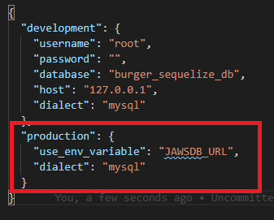

# Heroku Deployment Guide for Sequelize Projects

* **Important**: Before you begin, make sure you have the `mysql` and `sequelize` NPM packages installed in your project.

* **Note**: Steps 1-8 are the same here as in the vanilla deployment guide you were provided in Unit 12. We've repeated the steps here so you wont need to consult multiple guides at once.

## Part One: Creating a JawsDB Remote Database

1. On your local machine, navigate to your project folder. At this point, we'll assume you've been pushing/pulling your code with GitHub but have yet to deploy to Heroku.

2. Type in `heroku create`. That will create a Heroku app and set it up on Heroku.

3. Navigate to [Heroku](https://www.heroku.com) and login with your credentials.

4. Find your Heroku app's name in the dashboard. Click it.

5. Look for the Add-Ons section in your app's dashboard and type `JawsDB` in the input field. That should bring up the `JawsDB MySQL` add-on.

6. Click on `JawsDB MySQL` and that should bring up a modal asking you to provision a specific tier plan.

7. Make sure you select the free option, then click `Provision`

8. You'll know that Heroku set up your database when a `JawsDB` entry shows up under the Add-Ons section.

## Part Two: Hooking Your Sequelize Project with JawsDB

1. In your `config.json` file, add `"use_env_variable":JAWSDB_URL"` to your `production` connection, as shown in the highlighted portion of this screenshot.

2. Notice how `process.env.JAWSDB_URL` lets you plug in your connection details with just a single phrase. When you set up the `JawsDB` Provision, Heroku saved the connection info in an environment variable, which your `config.json` file references with the `"JAWSDB_URL"` string. Your deployed application will connect to the `production` database (JawsDB), while your local application will connect to the `development`.

3. After adding the code above and pushing those changes to your GitHub repository's `main` branch, deploy your application to Heroku: `git push heroku main`.

4. Once you deploy your application, type in `heroku open --app YOURAPPNAME` to open your application in your browser.
